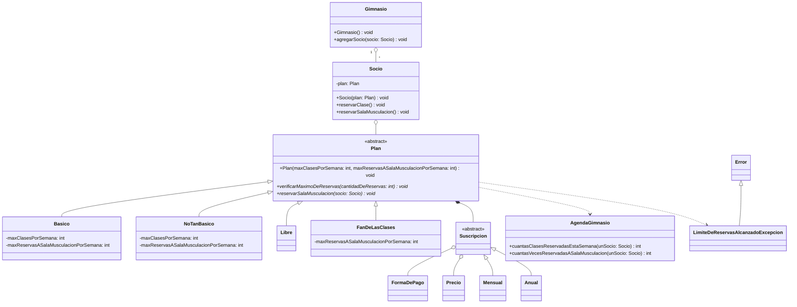

# Gimnasio

## **1 - Ejercicio de modelado**

### Se desea modelar parte de un sistema mediante el paradigma de objetos.
---

### Un gimnasio $\textcolor{blue}{\text{tiene}}$ diferentes $\textcolor{lightblue}{\text{planes}}$ para sus $\textcolor{lightblue}{\text{socios}}$, que determinan el $\textcolor{lightblue}{\text{uso de las instalaciones y actividades}}$, para lo cual los socios deben $\textcolor{lightblue}{\text{reservar}}$ cada tipo de actividad (clase o uso de sala de musculación), y no pueden ingresar si no hay $\textcolor{lightblue}{\text{reserva}}$. Hay distintos $\textcolor{blue}{\text{tipos}}$ de planes para asistir:

#### $\textcolor{lightblue}{\text{Plan Básico}}$: el socio puede $\textcolor{blue}{\text{tomar}}$ una clase grupal por semana, y utilizar la sala de cardio y la de musculación hasta dos veces por semana.
#### $\textcolor{lightblue}{\text{Plan NoTanBasico}}$: el socio puede $\textcolor{blue}{\text{tomar}}$ tres clases grupales por semana, y utilizar la sala de cardio y la de musculación hasta cuatro veces por semana.
#### $\textcolor{lightblue}{\text{Plan Libre}}$: el socio puede $\textcolor{blue}{\text{tomar}}$ clases grupales ilimitadas y utilizar las salas de musculación y cardio en forma ilimitada.
#### $\textcolor{lightblue}{\text{Plan FanDeLasClases}}$: el socio puede $\textcolor{blue}{\text{tomar}}$ clases grupal ilimitadas, y utilizar la sala de cardio y la de musculación hasta dos veces por semana.

### Los planes además pueden ser $\textcolor{lightblue}{\text{mensuales}}$ (se paga por mes) o $\textcolor{lightblue}{\text{anuales}}$ (se paga todo el año), $\textcolor{blue}{\text{teniendo}}$ diferentes $\textcolor{lightblue}{\text{precios}}$ y $\textcolor{lightblue}{\text{formas de pago}}$ según cual sea.

---

### Supondremos la existencia de una clase externa `AgendaGimnasio`, con una única instancia `agendaAlgoGimnasio`, a la cual todos los objetos pueden acceder, que tiene métodos `cuantasClasesEstaSemana: unSocio` , y `cuantasVecesASalaMusculacion: unSocio` , y devuelven cuantas reservas ya tienen para las tipo de actividades.

---

### Se pide:

### Modelar en UML (diagrama de clases) el dominio recién descrito. Use nombres adecuados para todas las clases, métodos y asociaciones que defina. Incluya todos los métodos que le parezca necesarios en las clases, pero ninguno más. Los métodos que utilice en los puntos B.a y B.b deben figurar en el diagrama.

---

### Modelar en UML (diagrama de secuencia, con objetos y mensajes) el caso completo para los siguientes escenarios:
* ### Un socio con plan **NoTanBasico** quiere reservar la sala de musculación.

* ### Un socio con el plan **FanDeLasClases** quiere usar la sala de musculación, pero ya la ha usado 2 veces esa semana.

> **IMPORTANTE**
> En cada diagrama de secuencia mostrar la inicialización de los objetos involucrados