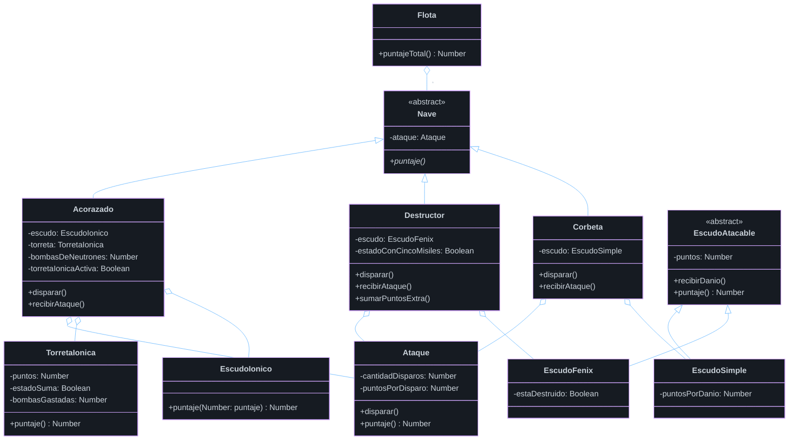
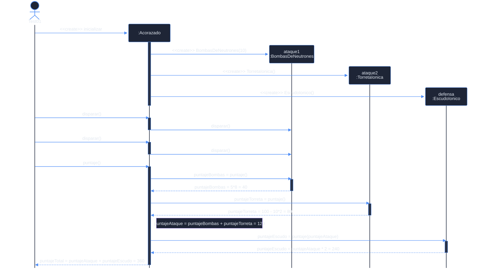
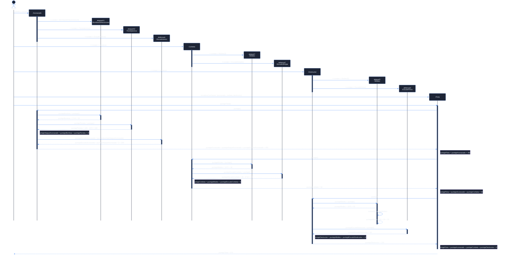

# Imperio intergaláctico

En un imperio intergaláctico existen distintos tipos de $\textcolor{purple}{\text{naves}}$ espaciales. El $\textcolor{purple}{\text{puntaje total}}$ de cada nave dependerá de con qué tipo de $\textcolor{purple}{\text{sistema de ataque y defensa}}$ esté equipada la misma, el estado actual de ambos y será la $\textcolor{purple}{\text{suma de ambos sistemas}}$.

---

### Características de una **Corbeta:** (30 + 20 = 50 puntos)

- Posee $\textcolor{purple}{\text{3 misiles}}$ que suman $\textcolor{purple}{\text{10 puntos}}$ cada uno. A medida que $\textcolor{purple}{\text{dispara}}$ se le van gastando. Si se queda sin misiles suma 0 puntos en ataque.
- Posee un $\textcolor{purple}{\text{escudo simple}}$, suma $\textcolor{purple}{\text{20 puntos}}$. A medida que $\textcolor{purple}{\text{recibe daños}}$ se le va restando los puntos. Por ejemplo: si una corbeta nueva recibe un ataque de 1 misil, luego del ataque el puntaje de su escudo será solamente de 10 puntos.

---

### Características de un **Destructor:** (50 + 20 + 50 = 120 puntos)

- Posee $\textcolor{purple}{\text{5 misiles}}$. Cuando el destructor tiene los 5 misiles suma $\textcolor{purple}{\text{10 puntos por cada uno + 20 puntos extras}}$. Con $\textcolor{purple}{\text{4 misiles}}$ o menos, sólo suma una unidad por cada misil. Si se queda sin misiles suma 0 puntos en ataque.
- Posee un $\textcolor{purple}{\text{escudo Fenix}}$ que suma $\textcolor{purple}{\text{50 puntos}}$, pero al ser destruido, el mismo revive en forma de escudo simple sumando 30 puntos.

---

### Características de un **Acorazado**: (50 + 100 + 150*2 = 450 puntos)

- Posee un doble sistema de ataque:
    - $\textcolor{purple}{\text{10 bombas de neutrones}}$. Suman $\textcolor{purple}{\text{5 puntos}}$ cada una. A medida que dispara se le van gastando hasta quedarse sin bombas y sumar 0.
    - Torreta iónica: Suma $\textcolor{purple}{\text{100 puntos}}$ al contar con las 10 bombas de neutrones, caso contrario resta $\textcolor{purple}{\text{10 puntos}}$ por cada bomba de neutrones gastada.
- Posee un escudo iónico, que $\textcolor{purple}{\text{multiplica x 2}}$ el puntaje de ataque que tenga la nave que lo contiene.

---

### Características de una Flota:

- Posee un número $\textcolor{purple}{\text{ilimitado}}$ de naves $\textcolor{purple}{\text{mayor a cero}}$. Su $\textcolor{purple}{\text{puntaje total}}$ será la suma de los puntajes totales de las naves que la componen.

---

Se pide:

### 1. Diagrama de clases (**completo**) que representen el modelo descrito.



---

### 2. Diagrama de secuencia para cada uno de los casos de uso. **IMPORTANTE**: En cada diagrama de secuencia se debe mostrar la inicialización de los objetos involucrados.

Los casos de uso son:

#### 1. Calcular el **puntaje total** de un **Acorazado** nuevo luego de disparar 2 bombas de neutrones.



#### 2. Calcular el **puntaje total** de una flota con una **Corbeta**, un **Destructor** y un **Acorazado** nuevos.



### 3. Código de prueba para cada uno de los casos de uso.

```smalltalk
test01puntajeDeUnAcorazadoCuandoDisparaDosBombas
	| puntajeEsperado acorazado puntajeAcorazado puntajeAtaqueEsperado puntajeDefensaEsperado |	
		
		"Arrange"	
		acorazado := Acorazado inicializar.
		
		"Act"
		acorazado disparar.
		acorazado disparar.
				
		puntajeAcorazado := acorazado puntaje.
		
		"Assert"
        puntajeAtaqueEsperado := 8*5 + 100 - (10*(10-8)).
        puntajeDefensaEsperado := puntajeAtaqueEsperado * 2.
		puntajeEsperado := puntajeAtaqueEsperado + puntajeDefensaEsperado.
		
		self assert: puntajeAcorazado equals: puntajeEsperado.
```

```smalltalk
test02puntajeDeUnaFlotaConUnaCorbetaUnDestructorYUnAcorazadoNuevos
	| puntajeEsperado acorazado puntajeFlota corbeta destructor flota |	

	"Arrange"	
	acorazado := Acorazado inicializar.
	corbeta := Corbeta inicializar.
	destructor := Destructor inicializar.

    "la flota posee un número de naves mayor a cero, debe cumplirse desde su inicialización"
	flota := Flota inicializarConNaves: {acorazado. corbeta. destructor}.
	
	"Act"		
	puntajeFlota := flota puntajeTotal.
	
	"Assert"	
    puntajeEsperado := 620.
	self assert: puntajeFlota equals: puntajeEsperado.
```